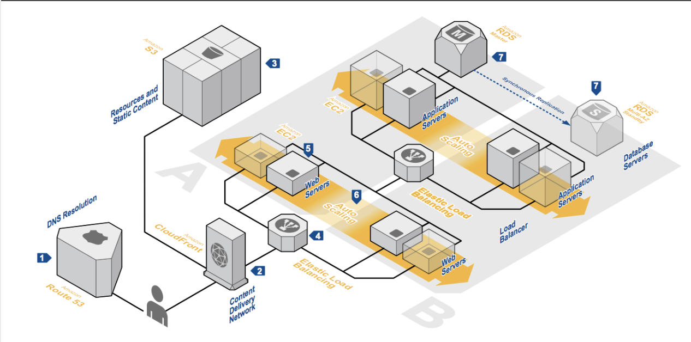
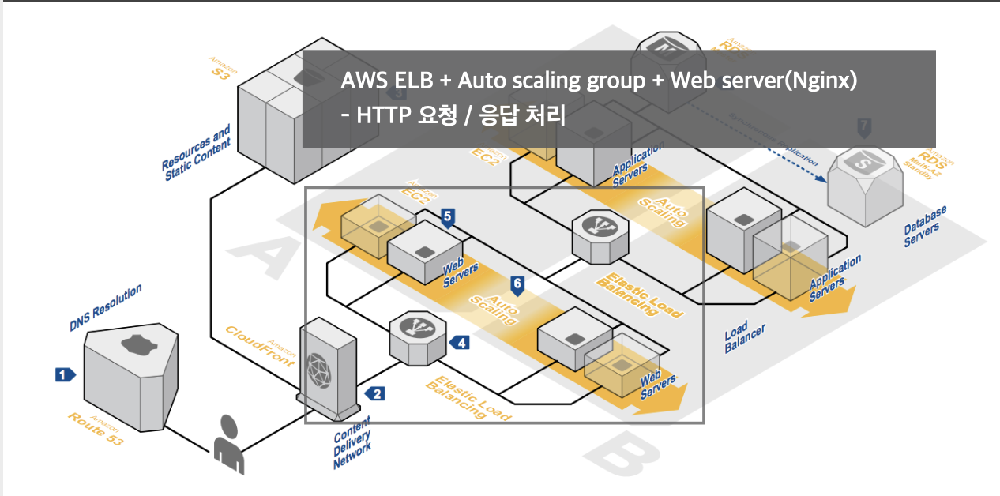
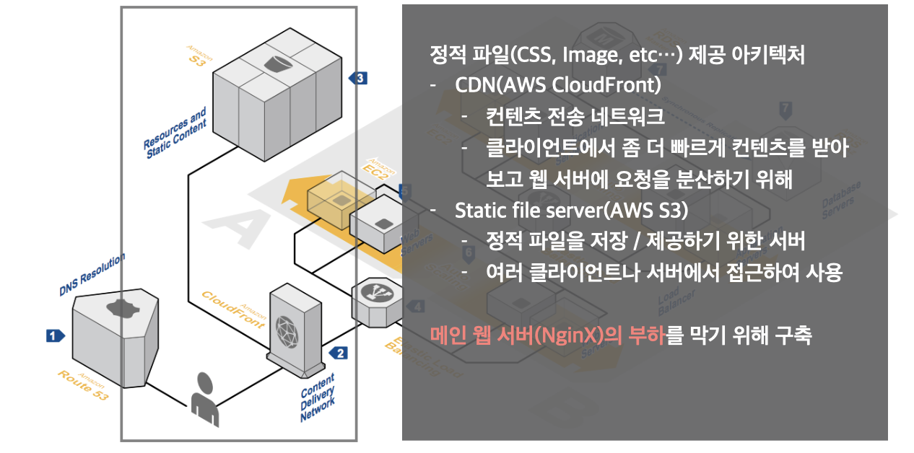
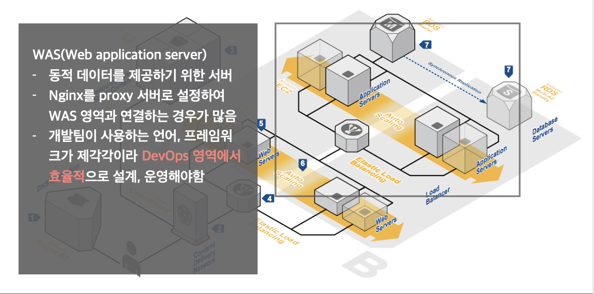
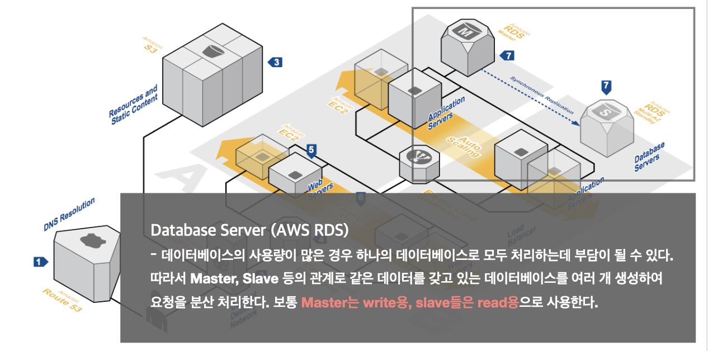

# Web architecture

## 기본 웹 아키텍쳐

## 서버리스 아키텍쳐
- Bass(Backend as a Service), Faas(Funcaion as a Service)
    - 서버 로직을 별도로 써드 파티 업체가 구현한 것을 쓰거나, 코드는 작성하지만 그 실행은 외부 업체를 통해 하는 것

### 장점
- 서버가 정말 필요한 경우에만 사용하여 비용을 절감할 수 있다.
- 코드 외적인 내용을 처리할 필요가 없어서 운영 비용을 절감 할 수 있다.
- 스케일을 키우는데 걱정할 필요가 없다.
- 불필요한 작업(서버 구성, 서버 관리)을 줄일 수 있다.

### 단점
제공되는 환경 내에서만 일을 처리할 수 있기 때문에 튜닝이나 외부 라이브러리 등 접근 측면에서 제한이 있을 수 있다.

## 모노리틱 아키텍쳐
제품 전체를 하나로 합쳐서 관리한다.

### 장점
- 서버를 구성하는데 간단하다.
- 기술 스택이 통일되어 있기 때문에 개발하기도 쉽다.
- 하나의 어플리케이션만 배포하면 된다.
    - 관리하기 쉬워진다.
- 스테일 아웃에 유리하다.

### 단점
- 하나의 큰 뭉터기 코드가 되어있기 때문에 수정하는 데 비용이 매우 커진다.
- 한번 정해진 기술, 버전을 굉장히 오래 써야한다.

## 마이크로 서비스 아키텍처

### 장점
- 제품이 하나의 기술, 버전에 묶여있지 않아도 된다.
- 도메인 별 어플리케이션들이 느슨하게 연결되어있기 때문에 추후 아키텍쳐 변화에 유연하게 대처할 수 있다.
- 여러 사람들이 큰 규모의 제품을 개발할 때 각 서비스간의 스펙만 맞추고 개발을 진행하면 되기 때문에 편하다.
- 전체 배포를 하지 않아도 되기 때문에 배포하기가 더 쉬워진다.
    - 페이스북 등 대형 서비스들도 하루에 수십, 수백번 배포가 가능하다.

### 단점
- 복잡도가 올라간다.
- 규칙 없이 막 사용했다간 사람보다 더 많은 기술 스택이 쌓일 수 있다.
- 서비스들 간 연동 테스트하기가 힘들다.

 
> 사람이 적고, 제품이 작을 땐 가볍고 빠르게 처리할 수 있는 monolithic이 더 낫다.
> 하지만 사람이 많아지고 제품의 규모가 커지는 경우에는 microservice는 선택이 아닌 필숙 된다.
> Microservice를 하기 위해선 배포, 테스트, 모니터링 자

# 많이 사용하는 제품들 

## HTTP Web server
**서비스**
- NginX
- Apache
- IIS (Windows 서버)

**차이점**
- 제공되는 OS
- 성능
- 연동되는 Application Server

## WAS
**서비스**
-Java
    -Tomcat, JBoss, Jetty
-Node.js
    - PM2(Process manager)
    - impress
- Python(WSGI)
    - GUnicorn, uWSGI
- Ruby
    - Phusion Passenger, Puma

**차이점**
지원하는 언어!

## Cache
**서비스**
- in-memory 데이터를 메모리에 저장, Read/Write
- Memcached
- Redis

**차이점**
- 제공되는 기능!
    - key/value store 넘어서 db, message broker등
    - 제공되는 데이터 구조

## Monitoring
**서비스**
- AWS Cloudwatch
- NHN Pinpoint : Opensource APM(Application performance monitoring)
- ELK : Elastic search, Logstash, Kibana
    - Log monitoring
- Grafana
    - Metric(cpu, ram, disk, etc... )monitoring

## CI/CD
**서비스**
    - Jenkins CI
    - Circle CI
    - AWS Codepipeline