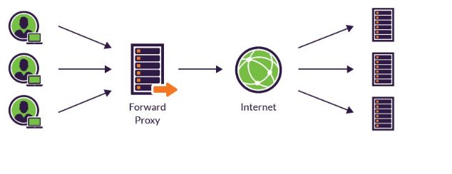
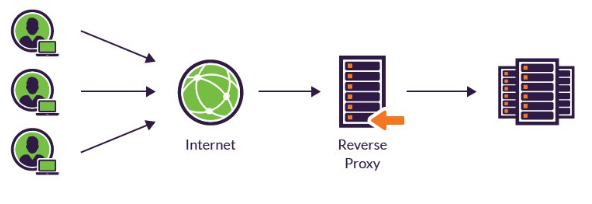

# nginx

## Apache MPM vs Nginx



**Apache MPM : \(multi Processing Module\) : 다중 처리 모듈**

여러 기법이 있지만, 다중 process 처리 혹은 worker\( + event방식\) 으로 처리 되는것이 전통적이다.  
\([더 자세한 내](https://megaidc.net/board_kRVd58/17022)용\) 



**Event driven** 방식을 통해 구동된다.  
한개의 고정된 프로세스만 생성하고, 그 프로세스 내부에서 비동기 방식으로 효율적으로 작업들을 처리한다.

* 동시 접속 요청이 많아도 Process또는 Thread생성 비용이 존재하지 않는다,



## nginx 란

nginx는 클라이언트로 부터 요청이 발생했을 때 요청에 맞는 정적 파일을 보내주는 역할을 하는 `웹 서버` 이다.  
nginx는 규모가 작은 서비스 이면서 정적 데이터 처리가 많은 서비스에 적합하다.  
\(하지만 네이버도 사용한다고 함\)

## nginx의 사용

* 로드밸런서 - 효율성, 안정성을 위함
* 리버스 프록시

### Proxy

**프록시 서버**는 클라이언트가 자신을 통해서 다른 네트워크 서비스에 간접적으로 접속할 수 있게 해주는 컴퓨터 시스템이나 응용 프로그램을 가르킨다.  
서버와 클라이언트 사이에 중계기로써 대리로 통신을 수행하는 것을 가르켜 `프록시` 그 중계기능을 하는 것을 프록시 서버라고 부른다. 클라이언트와 서버 간 통신을 직접 하지 않고 중계 서버인 플록시 서버를 사용하여 보안, 트래픽 분산 등 여러 장점을 가질 수 있는 서버이다.

프록시 서버는 서버로 요청된 내용을 캐시 해 놓고 동일한 요청 시 바로 응답을 주도록 설정할 수도 있어 리소스 사용을 절약할 수 있는 효과를 가져오기도 한다.  

### Forward Proxy

일반적으로 프록시라고 부르면 포워드 프록시를 지칭한다.  
클라이언트가 서버로 요청 할 때 직접 요청하지 않고 먼저 프록시 서버를 통해 요청하는 방식이다.  
_서버에게 클라이언트가 누구인지 감추는 역할을 해준다._  
서버가 응답받는 IP는 포워드 프록시 서버의 IP이기 때문에 클라이언트가 누군지 알 수 없다.

### Reverse Proxy

클라이언트가 서버를 호출할 때 프록시를 호출하게 되고 프록시 서버가 서버를 요청하여 받은 응답을 클라이언트에게 전달하는 방식이다.

리버스 프록시는 서버가 누구인지 감추는 역할을 해준다.  
클라이언트는 리버스 프록시 서버를 먼저 호출하게 되기 때문에 실제 서버의 IP를 알 수 없다.

## Proxy 서버의 장점

1. 보안
   * 프록시 버서를 사용하면 클라이언트나 서버 모두 IP를 숨길 수 있는 방법이 생긴다. 실제 서버 또는 클라이언트의 IP를 숨기고 프록시 서버의 IP만 공개함으로써 해킹을 대비 할 수 있다.
2. 성능
   * 프록시 서버를 사용하여 캐싱 기능과 트래픽 분산으로 성능 향상을 가져올 수 있다.
   * 캐싱 기능은 자주 사용되는 동일한 요청을 캐싱하여 재활용 하는 방식. 실제 서버로 다시 호출하지 않고 프록시 서버가 대신 응답을 주어 서버의 자원을 줄여준다.
3. 트래픽 분산
   * 프록시 서버는 로드 밸런싱을 제공하여 여러 대의 산된 서버가 있다면 서버의 트래픽을 분산시켜 준다.
   * 앤드포인트 마다 호출하는 서버를 설정 할 수 있어 역할에 따라 트래픽을 분산 할 수 있다.

